# MedicalDemo

This project was generated with [Angular CLI](https://github.com/angular/angular-cli) version 17.3.6.

## Development server

Run `ng serve` for a dev server. Navigate to `http://localhost:4200/`. The application will automatically reload if you change any of the source files.

## Code scaffolding

Run `ng generate component component-name` to generate a new component. You can also use `ng generate directive|pipe|service|class|guard|interface|enum|module`.

## Build

Run `ng build` to build the project. The build artifacts will be stored in the `dist/` directory.

## Running unit tests

Run `ng test` to execute the unit tests via [Karma](https://karma-runner.github.io).

## Running end-to-end tests

Run `ng e2e` to execute the end-to-end tests via a platform of your choice. To use this command, you need to first add a package that implements end-to-end testing capabilities.

## Screenshots of different pages

- Login Page:
    This is the initial login page of the application, featuring an animated loading effect.
    for login Credentical detail
    [db.json](http://localhost:3000/User)
  

- Login Page Validation
    The login page includes form validation and authentication checks to ensure that users enter valid credentials.
  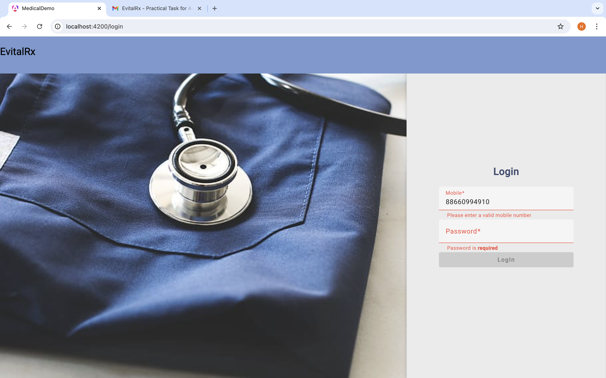
- Login Page Validation with password 
    The login page includes form validation and authentication checks to ensure that users enter valid credentials.
  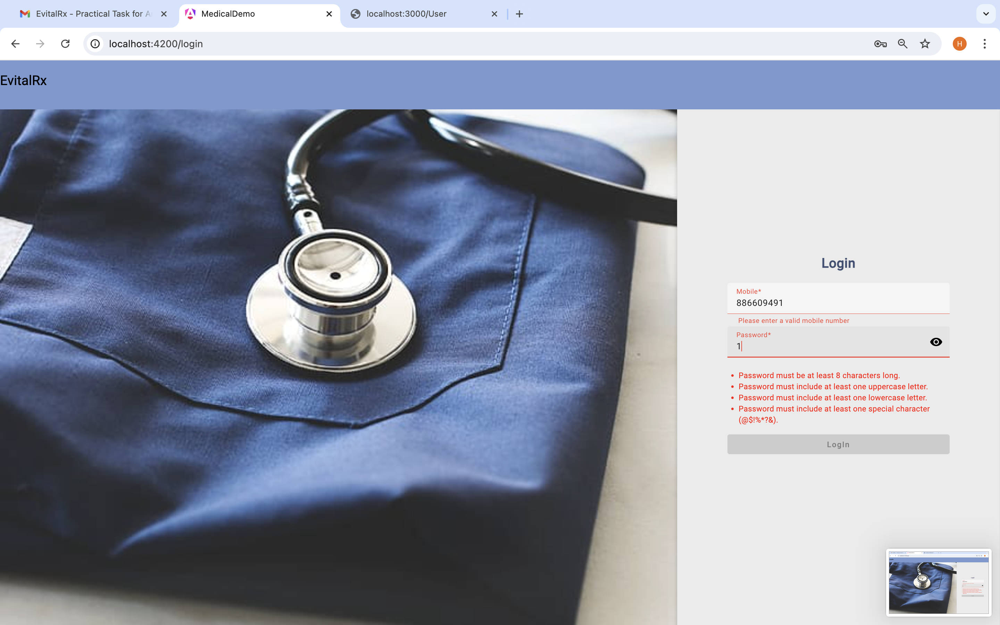
  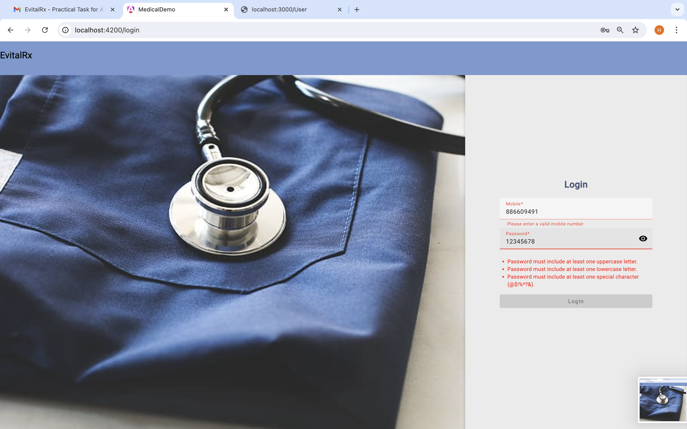

- Login Page - After Validation
     After successful validation and form submission, the application communicates with the login API.
  

- Dashboard page - After Search
    Once redirected to the Dashboard page, the application uses RXJS operators to call the API with the search input and displays a list of available medicines. If a medicine is not available, the "Add to Cart" button is disabled.
  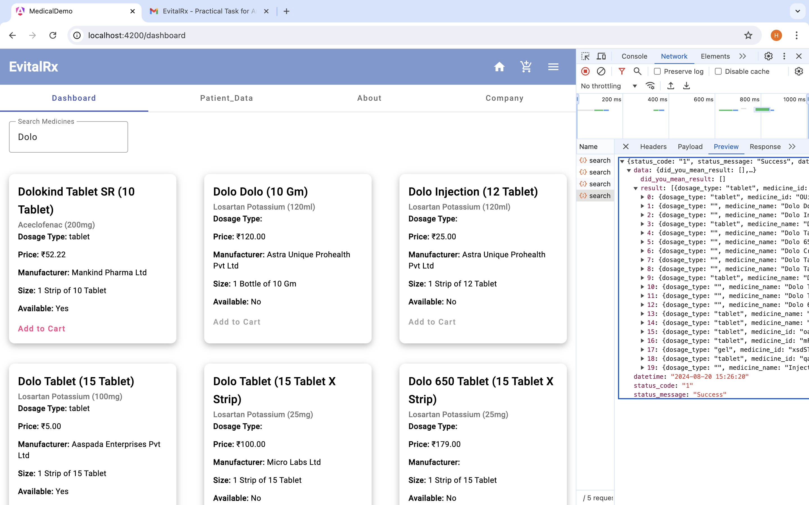

- Dashboard Page - Add Medicines to Cart
   On the Dashboard page, users can click the "Add to Cart" button to add items to their cart.
  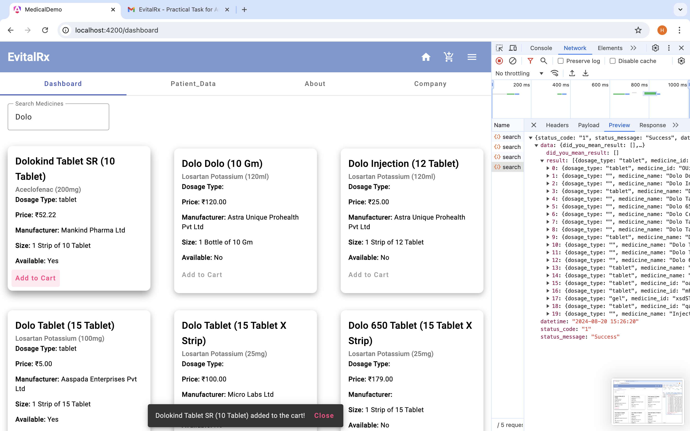

- Dashboard Page - Cart Icon
   After adding medicines to the cart, users need to provide patient data to proceed with the order. The checkout button will be disabled until all required patient information is provided.
  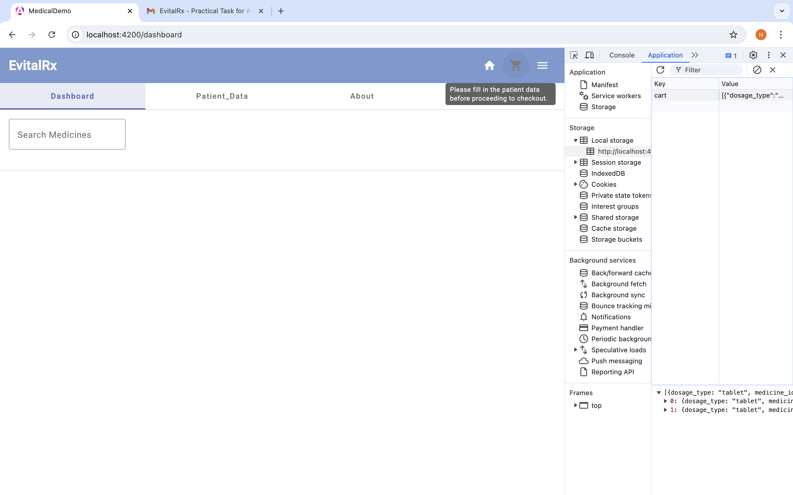

- Patient Page - Required Patient Data with Validation
   This is the patient data form that includes validation checks to ensure that all necessary fields are correctly filled out.
       
  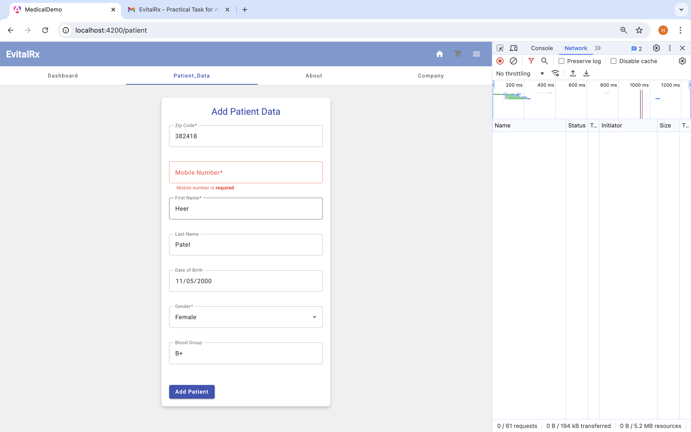

- Patient Page - After Filling Form Data
     After filling out the patient data form, users can review the entered information before submitting it.
  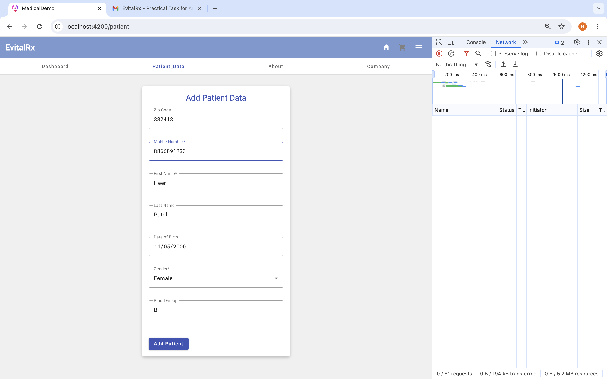

- Patient Page - Form Submission and API Call
   Upon form submission, the application calls the API to process the patient data.
  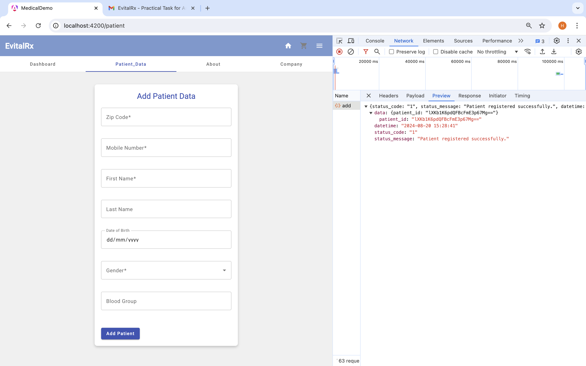

- Checkout page - Go to checkout
   On the checkout page, users can remove items from the cart and enter the delivery pincode before calling the API to place the order.
  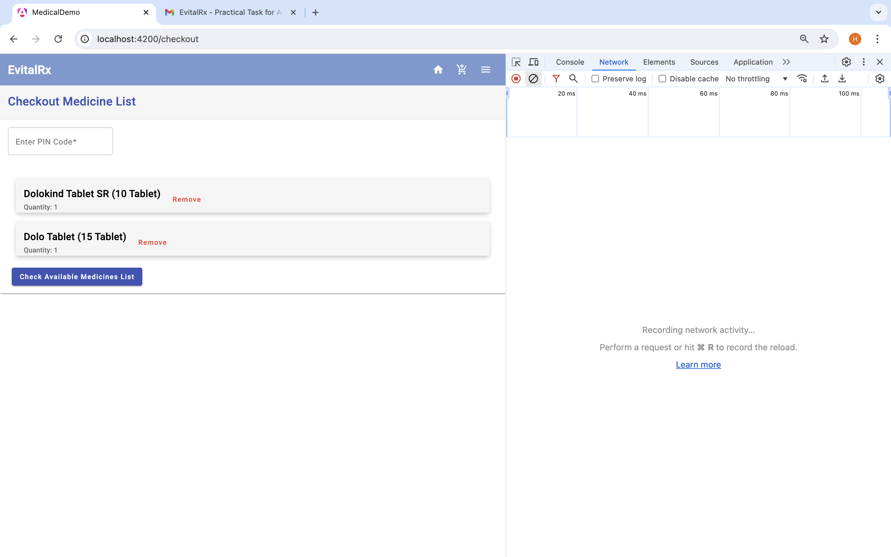

- Checkout Page - Call Checkout API
   The application calls the checkout API and redirects the user to the place order page.
  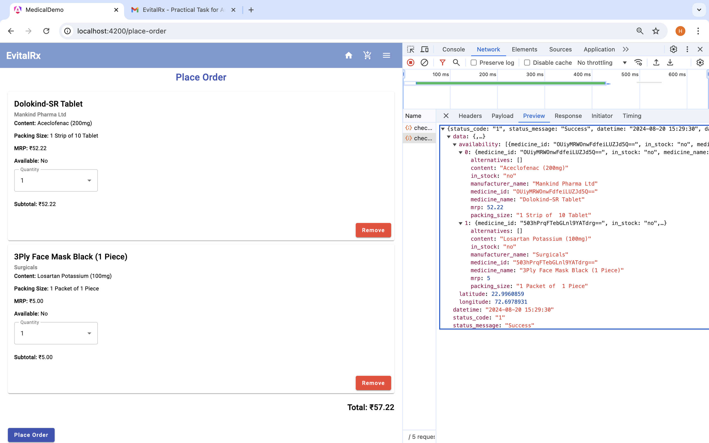

- Place Order - Manage Medicine Quantity
  Users can increase or decrease the quantity of medicines, and the total price will be updated accordingly.
  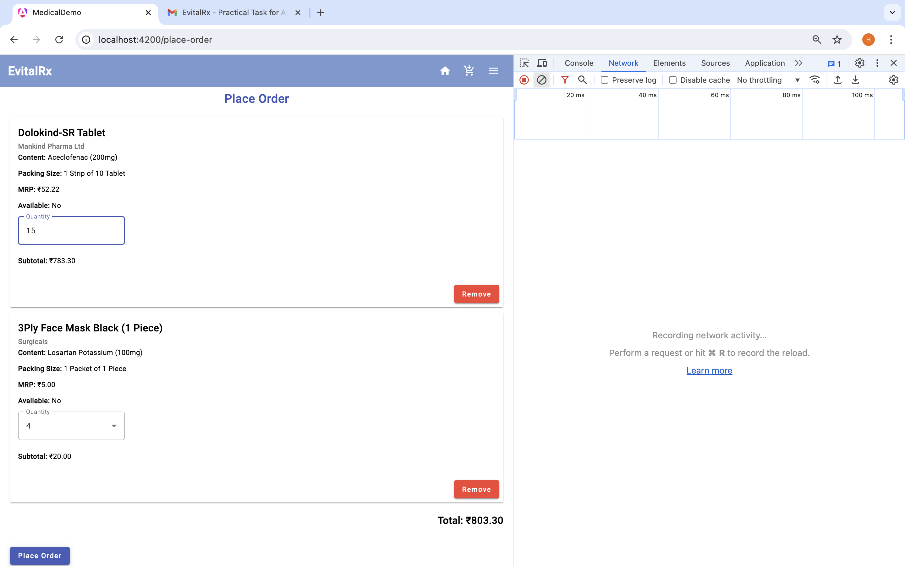

- Confirm Place Order - Form Data with Validation
  This page includes the form for confirming the order, with validation for the delivery address.
  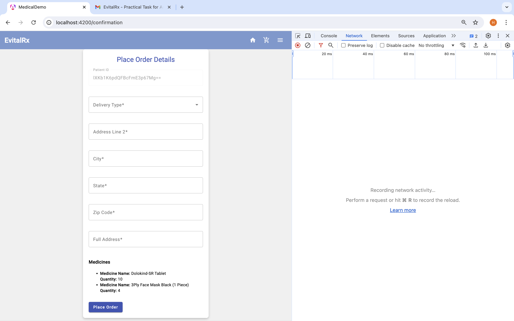

- Confrim Place - Fill form and call API
  After filling out the confirmation form, the application calls the place order API and redirects the user back to the dashboard or home page.
  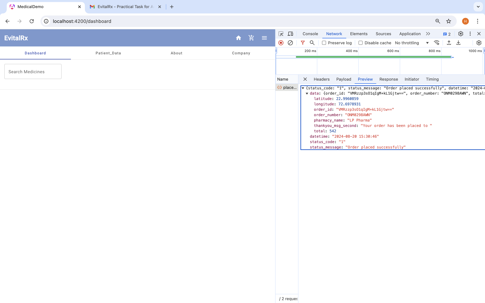

## Further help

To get more help on the Angular CLI use `ng help` or go check out the [Angular CLI Overview and Command Reference](https://angular.io/cli) page.
